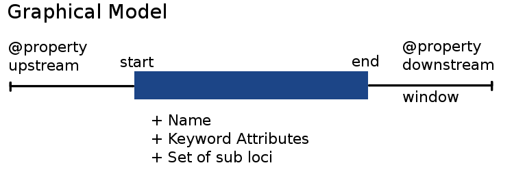
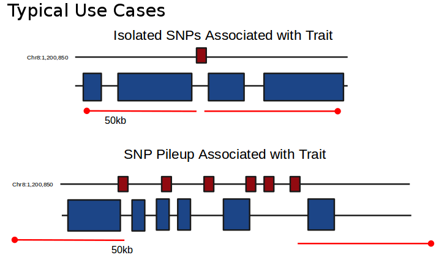
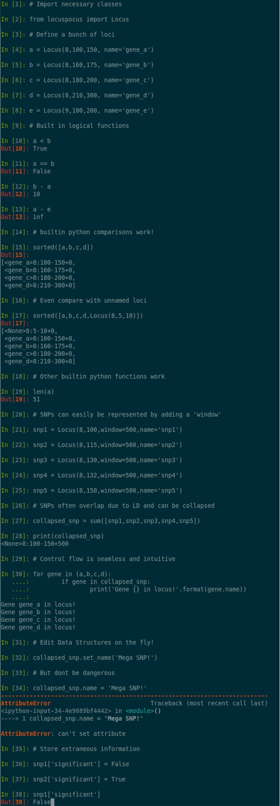

# LocusPocus - Genetic coordinates so simple, it feels like MAGIC!

Description
-----------
At its foundation, the genome is composed of a number of chromosomes. These
structure are easily thought of as linear sequences of nucleotides (usually
denoted as 'bases': A,C,G and T).  While this basic sequencial model is
conceptually simple, practical problems quickly arise.  What is functionally
interesting about a genome isn't its sequence, but rather, the *variation* in
sequence between one individual and another. It is these *differences* that
ultimately drives that unbelievable amount of variation observed in all living
things!

Before large scale genome sequencing was possible, interesting features on a
chromosome were described as loci (or a single locus). These features were very
abstract due to the fact that is was impossible to quantitatively pinpoint
where they were on a chromosome. Instead, loci were related to one another
based on their ordering on the chromosome. These ordering produced the first
*genetic maps* and were extremely useful in examining how an organisms traits
or physical features changed when you altered combinations of diverse loci.

A sequenced reference genome establishes a genetic coordinate system in which
sequencing technologies can relate various genomic features. However, the
genetic coordinate unit, or locus, is not well represented by common data
structures available in contemporary programming languages, often leading to
error-prone, ad-hoc implementations. Here, we implement the Locus as a
fundamental, object-oriented datatype in pure-Python, which enables convenient
relational algebra including powerful expressions to be built which make sense
in the scope of loci. 

Operations such as calculating distance between two
loci or whether they overlap are achieved by overloading the “in” (x in y) and
“subtraction” (x - y) Python mathematical operators making comparisons
intuitive; relative genomic positions and equality can be tested using built-in
Python “greater-than” (x > y), “less-than” (x < y), and “equals” (x == y)
operators. Extending these basic comparison methods, a nested sub_locus feature
is implemented by overloading the “addition” operator (x + y) allowing the
construction of more complicated genomic features such as combining SNPs which
have overlapping, user-defined windows. More specific features such as genes
and entire chromosomes can be easily implemented by extending the base Locus
class and adding feature-specific logic accordingly. Implementation of a
genetic coordinate class in Python allows for quick and easy execution of
common locus related tasks. The extensive overloading of built-in Python
operators makes code more readable and less prone to bugs. The latest version
of LocusPocus can be found on PyPi. Upstream development can be accessed via
GitHub: https://github.com/schae234/LocusPocus.

LocusPocus Model
----------------



Use Cases
---------


Many canonical genomic structures can be represented by extending a basic
locus. Genes are named loci with strand information, SNPs are single base pair
with allele information. Simple relational algebra makes comparisons between
loci and logical flow within programs computing loci easy. For instance, SNPs
often 'pile up' around loci due to linkage disequilibrium (LD). Initializing a
locus with the same start and end position as well as a surrounding window
establishing LD represents a SNP. SNPs within the same LD window can be
collapsed by simply adding them while sub_loci are automatically . Other
relational can be made, such as testing if loci overlap using the `in`
operator.


Examples
--------


```{python}
# Import Necessary Classes
from locuspocus import Locus

# Create a Locus
a = Locus(8,100,150, name='gene_a')
# Createa  couple more!
b = Locus(8,160,175, name='gene_b')
c = Locus(8,180,200, name='gene_c')
d = Locus(8,210,300, name='gene_d')
e = Locus(9,100,150, name='gene_e')

```

Installation
------------

### Conda Virtual Environment
Running the included installation script will install LocusPocus into its own
python virtual environment. **Note:**This script will download and install files
into your home directory under `~/.locuspocus`. 

```{bash}
    # Download the repo
    git clone git@github.com:schae234/LocusPocus.git
    # Change directories
    cd LocusPocus
    # Run the install script
    ./install.sh
    # Activate the conda virtual environment
    source activate locuspocus
    # locus pocus should be importable via python!
```

You will need to add a few lines to your .bashrc in order for the conda
environment to be available from your shell.

e.g.:
```{bash}
    # Assuming your installed camoco to ~/.camoco
    export LD_LIBRARY_PATH=~/.locuspocus/lib/:$LD_LIBRARY_PATH
    export PATH=$BASE/bin:~/.locuspocus/conda/bin/:$PATH
```


### python setup.py file
Alternatively, you can run the normal `setup.py` script.

```{bash}
    # Download the repo
    git clone git@github.com:schae234/LocusPocus.git
    # Change directories
    cd LocusPocus
    # run the setup script
    python setup.py install --user
```


Development
-----------
**NOTE!:** This package used Cython to perform some of the heavy lifting, 
especially in the Loci class to calculate pairwise distance. To work on the
code without needing to repeatedly compile and install the Cython code 
run the following commands in the base cloned directory:
```{bash}
BASE=$(pwd)
export PYTHONPATH=$BASE:$PYTHONPATH
sed -ie 's/^#.*pyx//' $BASE/locuspocus/__init__.py

``` 

License
-------
LocusPocus is freely available under the MIT license, see LICENSE for more info
